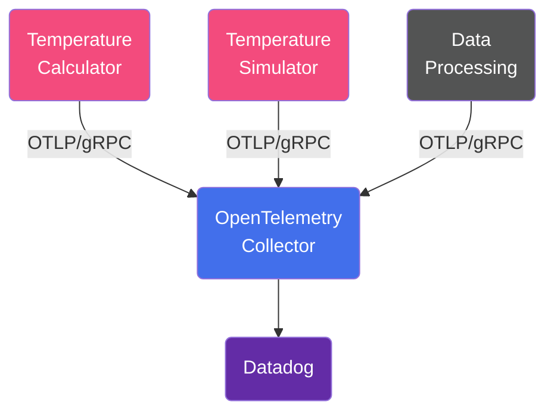

# OpenTelemetry Instrumentations

This repository has an application example to demonstrate 3 different ways of instrumenting
a service, all 3 services are instrumented to produce Traces, Metrics and Logs:

- [Temperature Simulator](/src/temperature-simulator/) is instrumented using manual instrumentation.
- [Data Processing](/src/data-processing/) is instrumented using instrumentation libraries.
- [Temperature Calculator](/src/temperature-calculator/) is instrumented using auto-instrumentation
(OTel Java agent) and manual instrumentation.

## Application Diagram


## How to run

1. Navigate to the [`.env`](.env) file and add your Datadog credentials:
    - eg:

    ```yaml
    DD_SITE=datadoghq.eu
    DD_API_KEY=1abc2def3ghi4xxx567
    ```

1. From the root folder, run:

    ```shell
    docker compose up -d
    ```

1. Send some requests to the application. This can be done in 2 different ways:

    1. `curl` the `simulateTemperature` endpoint:

        ```shell
        curl "localhost:8080/simulateTemperature?measurements=5&location=New%20York"
        ```

    1. Call the [`traffic.sh`](traffic.sh) script, which simulates a traffic of 1-10
    requests per minute.

        ```shell
        ./traffic.sh
        ```

## Observability Diagram

You can check the full Collector configuration in the
[`otelcol-config.yml` file](src/otelcollector/otelcol-config.yml).


